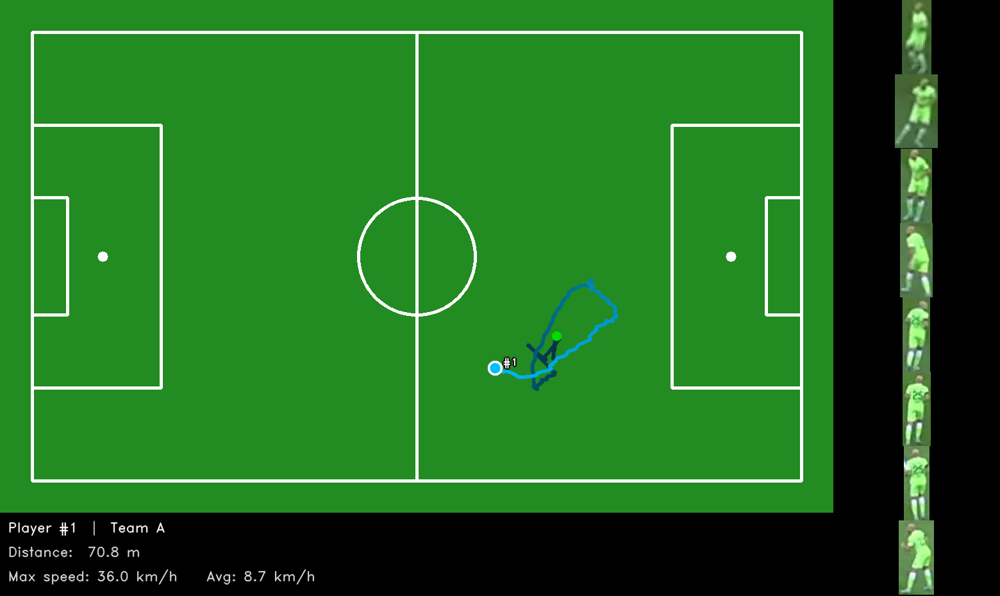
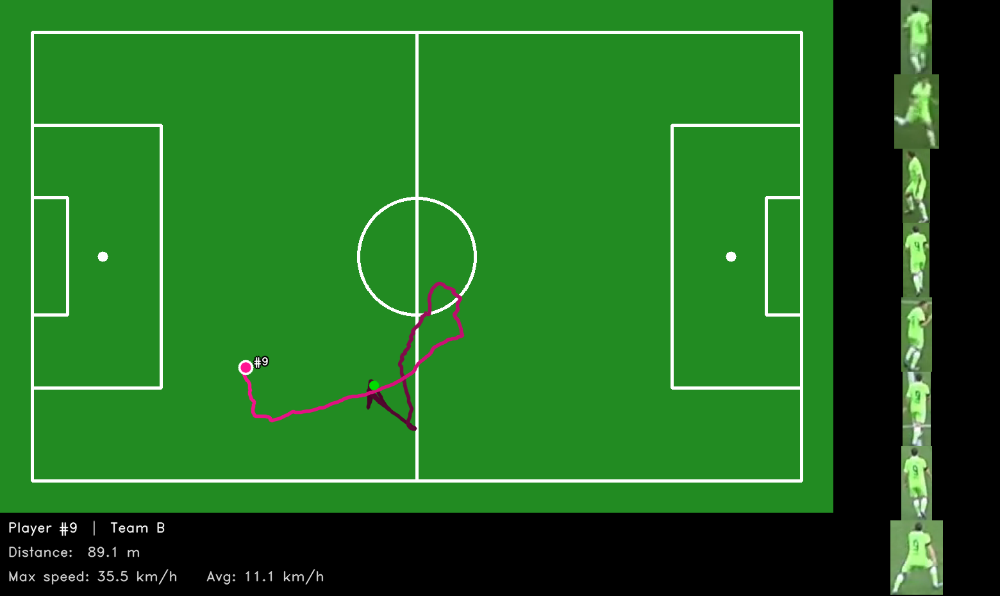
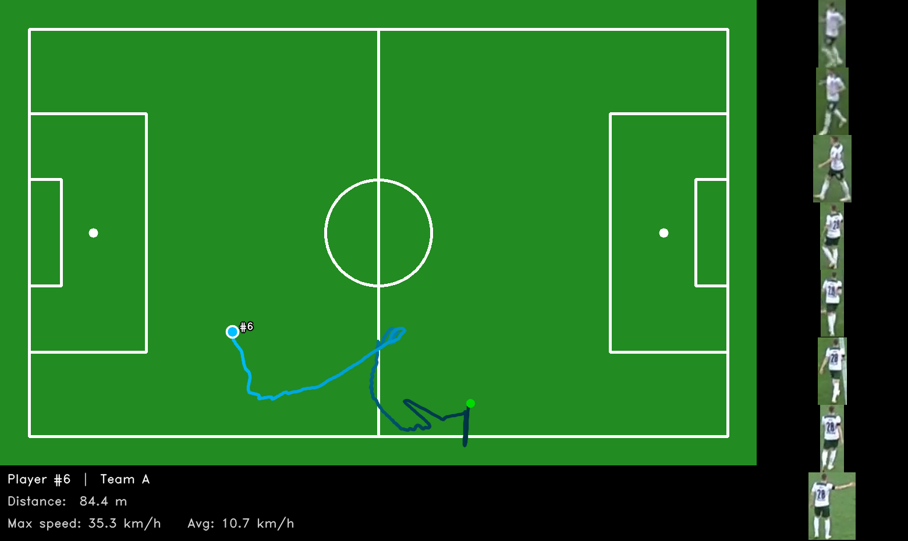

# Soccer AI Vision

Pipeline phân tích video bóng đá: phát hiện cầu thủ/bóng, tracking, phân team bằng màu áo, hiệu chỉnh camera sân và thống kê cầu thủ — chạy từ video broadcast thông thường.

## Demo


**Video đầy đủ (68MB):** [result.mp4 — GitHub Releases v0.1.0](https://github.com/NRI12/soccer-ai-vision/releases/tag/v0.1.0)

| Player stats overlay — Team 0 | Player stats overlay — Team 1 |
|---|---|
|  |  |

## Tính năng

- **Detection** — YOLO11 finetune trên SoccerNet (8 lớp: ball, player trái/phải, thủ môn, trọng tài, staff)
- **Tracking** — ByteTrack, giữ tracker ID xuyên suốt video
- **Team classification** — KMeans k=2 trên màu áo (LAB), tự động không cần nhãn cứng
- **Re-Identification** — OSNet x1.0 finetune trên SoccerNetV3, khôi phục ID khi cầu thủ bị che / rời frame
- **Camera calibration** — NBJW keypoint + line detection → homography → minimap pitch coordinates
- **Player stats** — tốc độ, quãng đường, heatmap, video highlight theo từng cầu thủ

---

## Kết quả training

### Detection — YOLO11s finetune SoccerNet (8 classes)

| Metric | Giá trị |
|---|---|
| mAP50 | **81.9%** |
| mAP50-95 | 58.3% |
| Precision | 77.3% |
| Recall | 78.9% |
| Backbone | YOLO11s |
| Dataset | SoccerNet detection |
| Epochs | 86 (early stop / 500) |
| Image size | 640 |

| Confusion matrix | Training curves |
|---|---|
|  |  |

### Detection — Baseline YOLO12x (Roboflow dataset)

| Metric | Giá trị |
|---|---|
| mAP50 | **82.7%** |
| mAP50-95 | 58.2% |
| Precision | 90.1% |
| Recall | 75.8% |
| Backbone | YOLO12x |
| Dataset | football-players-detection (Roboflow) |
| Epochs | 120 |
| Image size | 640 |

### Re-ID — OSNet x1.0 (SoccerNetV3)

Training: 10 epochs, batch 256 (P=32 identities × K=8), triplet + softmax loss, RTX 3090 — 1h 45min.

| Split | mAP | Rank-1 |
|---|---|---|
| SoccerNetV3 (val) | **83.7%** | 78.5% |
| SoccerNetV3 (test) | **83.4%** | 78.0% |

Source code + checkpoints: [`research/training/reid/osnet_reid/`](research/training/reid/osnet_reid/)

---

## Player stats — sample output

Pipeline xuất thống kê và video highlight cho từng cầu thủ.

### Sample overlay PNGs

| Player 1 (Team 0) | Player 6 (Team 0) | Player 9 (Team 1) |
|---|---|---|
|  |  |  |

### Sample JSON — [`docs/samples/player_stats.json`](docs/samples/player_stats.json)

```json
[
  {"tracker_id": 1, "team": 0, "num_frames": 747, "total_distance_m": 70.8,
   "max_speed_kmh": 36.0, "avg_speed_kmh": 8.7},
  {"tracker_id": 6, "team": 1, "num_frames": 743, "total_distance_m": 84.4,
   "max_speed_kmh": 35.3, "avg_speed_kmh": 10.7},
  ...
]
```

---

## Cài đặt

```bash
uv sync
```

## Chạy

```bash
# Pipeline đầy đủ (Hydra config)
python main.py video.source_path=data/match.mp4 video.output_path=output/result.mp4

# Team classification từ màu áo (KMeans, mặc định)
python main.py team.mode=from_color

# Dùng nhãn team từ model (nhanh hơn, cần model train đúng left/right)
python main.py team.mode=from_model

# Demo realtime
python realtime.py --source data/match.mp4 --output output/rt.mp4
```

## Cấu trúc dự án

```
soccer_ai/                  # core pipeline: detector, tracker, reid, calibration, stats, visualizer
conf/                       # Hydra config: detect, track, team, pitch, reid, annotate
research/
  training/
    detection/              # YOLO finetune scripts
    pitch/                  # NBJW keypoint training
    reid/
      train_reid.py         # lightweight trainer (custom data)
      osnet_reid/           # full SoccerNet OSNet framework + checkpoints
  results/                  # training outputs (curves, confusion matrix, logs)
weights/                    # inference weights (không commit — xem soccer_ai/download_data.py)
docs/samples/               # sample output PNGs + player_stats.json
```

## Training Re-ID từ đầu

```bash
cd research/training/reid/osnet_reid

# Download SoccerNetV3 dataset (cần password SoccerNet)
python tools/download_data.py --password <your_password>

# Train (RTX 3090 config)
bash train.sh configs/rtx3090_config.yaml

# Evaluate checkpoint
bash test.sh checkpoints/checkpoint.pth
```
