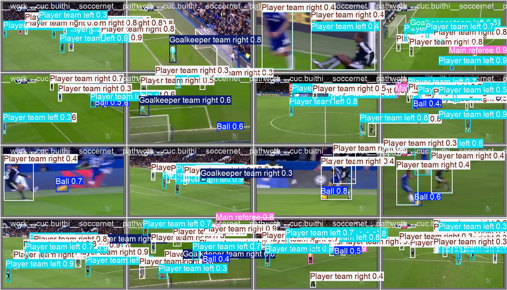
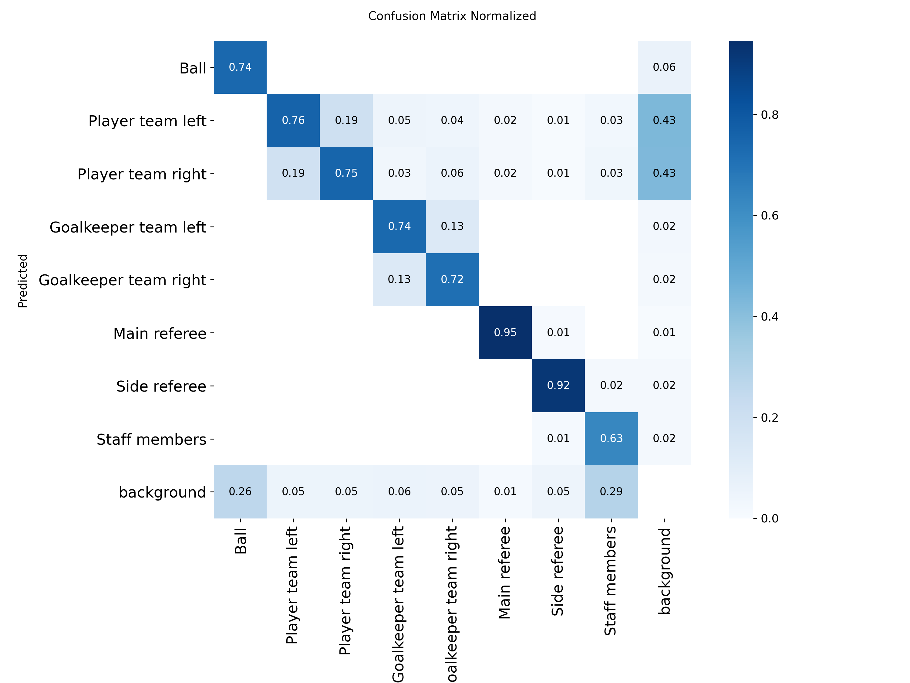
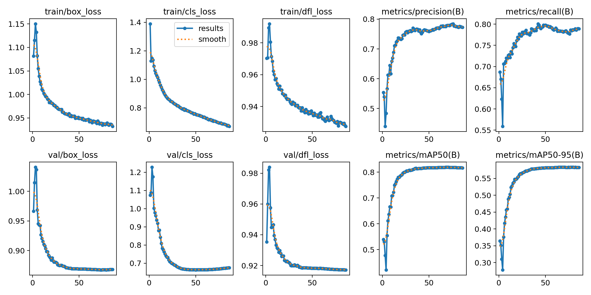

# Soccer AI Vision

Pipeline phân tích video bóng đá: phát hiện cầu thủ/bóng, tracking, nhận diện đội,
hiệu chỉnh camera sân và thống kê cầu thủ — chạy từ video broadcast thông thường.



## Tính năng

- **Detection** — YOLO11 finetune trên SoccerNet (8 lớp: ball, player trái/phải, thủ môn, trọng tài, staff)
- **Tracking** — ByteTrack, giữ ID cầu thủ xuyên suốt trận đấu
- **Re-Identification** — OSNet, khôi phục ID khi cầu thủ bị che khuất / rời khung hình
- **Camera calibration** — NBJW keypoint/line detection để chiếu tọa độ sân thật → minimap
- **Player stats** — xuất thống kê + video highlight theo từng cầu thủ

## Kết quả model

| Confusion matrix | Training curves |
|---|---|
|  |  |

## Cài đặt

```bash
uv sync
```

## Chạy

```bash
# Pipeline đầy đủ (Hydra config trong conf/)
python main.py video.source_path=data/match.mp4 video.output_path=output/result.mp4

# Demo realtime nhanh, không cần Hydra
python realtime.py --source data/match.mp4 --output output/rt.mp4
```

## Cấu trúc dự án

```
soccer_ai/        # core: detector, tracker, reid, calibration (nbjw), stats, visualizer
conf/             # Hydra config (pipeline/detect, track, team, pitch, reid, annotate)
research/         # training notebooks, kết quả huấn luyện model
weights/          # model weights (không commit, tải riêng — xem soccer_ai/download_data.py)
```
